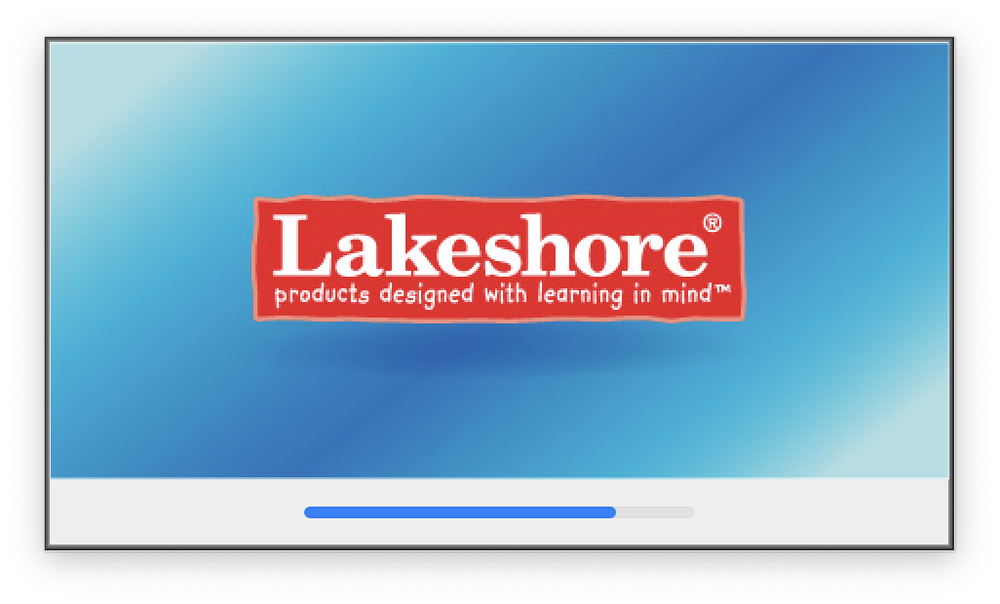

# Bayou Coast

Bayou Coast is a conversion tool for Lakeshore Learning flash based games for macOS.

### [Direct Download](https://github.com/Kfeavel/bayou-coast/releases/download/v1.0.0/Magic.Conversion.Wizard.zip) (via Github Releases)

## What's Included

There are two methods of conversion provided by this repository. One is an Automator based wrapper around a shell script (embedded in the Automator wrapper itself) and the other is shell script itself (copied directly from the Automator wrapper). Both accomplish the same task of accepting an installer binary, extracting the game, and then patching it to work on modern macOS.

For details on how this was accomplished, keep reading.

## History

All Lakeshore Learning games are instaled using a universal installer written in Java. This is designed to allow installation onto any OS (at least as far as Windows and macOS go). The problem is that the macOS installer is a universal binary compiled for ppc and x86 macOS, *not* x86_64, which means it no longer executes on modern macOS, even with Rosetta since [Apple deprecated 32-bit binaries](https://support.apple.com/en-us/HT208436).

This presents a problem.

**How can the application be installed if the installer is too old to run?**

### Attempt #1

First a little backstory. Java used to be a first-class languge on macOS, one with full Xcode and macOS support. While Java is still supported on macOS today, it's a shadow of its former self. In order for Java applications to be bundled as a standard macOS `.app`, a `JavaApplicationLauncher` binary would be copied into the `.app/Contents/MacOS` directory. This binary would simply setup a Java environment and being executing the actual Java binary. (The entire native binary is only 58 Kb in size!) Unfortunately, attempting to execute the `JavaApplicationLauncher` provided with the game installer won't work [due to missing frameworks](https://stackoverflow.com/questions/70386565/system-cannot-find-javaapplicationlauncher) that have since been deprecated and removed from macOS (or something else, not entirely sure).

The first attempt made was to replace the existing `UniversalJavaLauncher` with a wrapper for modern macOS. Fortunately, such a thing [already exists](https://github.com/tofi86/universalJavaApplicationStub). Unfortunately, this too fails due to missing frameworks, albeit much later into the application intialization. The result is a splash screen that shows the Lakeshore Learning logo but a stacktrace dialog following shortly thereafter, as seen below.




### Attempt #2

By this point it was clear that attempting to get the installer to execute was not going to work, or at least would require significantly more reverse engineering than this project was worth. The question of running the installer in a VM was considered, but since the target audience for these games is primary teachers, most of whom would not understand how to use a VM, that option was ruled out. So, effort pivoted to extracting the game assets and binary from the installer, since this was just the installer after all, not the actual game of interest. This tactic was far more appealing than a VM since it would offer an easily repeatable set of actions if possible.

From this point, focus shifted to understanding the installer contents and hierarchy since the game assets had to be *somewhere* on disk. It was only a question of where the files lived and how difficult it would be to obtain them. The first place to start is always understanding what's available to work with, which is shown below by the output of `tree` on the installer `.app`.

```
HH951-Setup 2.app
└── Contents
    ├── Info.plist
    ├── MacOS
    │   ├── HH951-Setup
    │   └── HH951-Setup copy
    ├── PkgInfo
    └── Resources
        ├── InfoPlist.strings
        ├── Java
        │   ├── Disk1
        │   │   └── InstData
        │   │       ├── MediaId.properties
        │   │       └── Resource1.zip
        │   ├── Execute.zip
        │   ├── IAClasses.zip
        │   ├── InstalledMedias.properties
        │   ├── MediaFiles.properties
        │   └── installscript.zip
        ├── SelfExtractor.icns
        └── en.lproj

7 directories, 13 files
```

Immediately the `Contents/Resources/Java/Disk1/InstData/Resource1.zip` file sticks out due to the `InstData` directory implying it contains all of the installation data and `Resource1.zip` being the only other file of interest conatained within. Interestingly, however, attempting to extract `Resource1.zip` with `Archive Utility.app` fails with error shown below.


Readers familiar with the inner workings of Java might have already determined why this is the case. This zip file is not any ordinary zip file, it's actually a Java Archive (`.jar`)! In reality, there's actually no difference between a Java Archive and a standard Zip format.

According to [Wikipedia](https://en.wikipedia.org/wiki/Jar_(file_format)#Extraction),

> The contents of a file may be extracted using any archive extraction software that supports the Zip format [...]

So then why did Archive Utility fail to extract `Resource1.zip`? To be completely honest, the answer isn't quite clear. Apparently at one point Archive Utility did extract Jars without issue as reported by [this discussion](https://discussions.apple.com/thread/4214456) on Apple's official forums. Throwing the main Archive Utility into Ghidra doesn't immediately reveal any sort of file blacklist like originally thought, so it's likely caused by a refactor at some point.

So, with that out of the way, how can the contents be extracted? The answer is surprisingly simple. The `unzip` command provided by macOS works perfectly fine and extracts the contents without issue!

The contents of `Resource1.zip` are as follows.

```
Resource1
├── MakeExecutableAction_zg_ia_sf.jar
├── Volumes
│   └── 10.6
│       └── Lakeshore
│           └── Phonics Tic-Tac-Toe Reading Game
│               ├── Build
│               │   └── Gold_Updated
│               │       ├── Rockin@u2019 Rhyme A Phonemic Awareness Game.app_zg_ia_sf.jar
│               │       ├── Rockin@u2019 Rhyme A Phonemic Awareness Game.exe
│               │       ├── assets_zg_ia_sf.jar
│               │       ├── fscommand
│               │       │   ├── Winmaximizer.exe
│               │       │   ├── file.app_zg_ia_sf.jar
│               │       │   ├── file.bat
│               │       │   ├── fullscreen.app_zg_ia_sf.jar
│               │       │   └── openPdf.app_zg_ia_sf.jar
│               │       ├── game_assets_zg_ia_sf.jar
│               │       ├── question_assets_zg_ia_sf.jar
│               │       └── xml_zg_ia_sf.jar
│               └── Installer Inputs
│                   ├── RickyInstallerIcon.ico
│                   └── Version_1.5.0.0.txt
└── uninstallerCustomCode.jar
```

To be pedantic, the root `Resource1` directory was created to contain the `.zip` contents and is not created by the `unzip` command.

From here, `Resource1/Volumes/10.6/Lakeshore/Phonics Tic-Tac-Toe Reading Game/Build/Gold_Updated/Rockin@u2019 Rhyme A Phonemic Awareness Game.app_zg_ia_sf.jar` becomes a pretty attractive next target. One interesting thing to note before continuing is the `Phonics Tic-Tac-Toe Reading Game` directory. An astute reader might notice that this directory does not match the name of the game to be installed, which is `Rockin@u2019 Rhyme A Phonemic Awareness Game`. (The weird `@u2019` part will be addressed later!) Every single installer, all for different games, had the same directory structure. This is likely a case of "it works, don't touch it!" on the part of the Lakeshore Learning developers. The final conversion script does actually handle the case where this directory is named something else, but it's an oddity worth noting.

Going back to `Rockin@u2019 Rhyme A Phonemic Awareness Game.app_zg_ia_sf.jar`, the first step is obviously to extract it just like before. The contents of the Jar are as follows.

```
Rockin@u2019 Rhyme A Phonemic Awareness Game.app_zg_ia_sf
└── Contents
    ├── Info.plist
    ├── MacOS
    │   └── Flash Player
    ├── PkgInfo
    └── Resources
        ├── Flash Player.rsrc
        ├── cs.lproj
        │   └── Localized.rsrc
        ├── de.lproj
        │   └── Localized.rsrc
        ├── document.icns
        ├── en.lproj
        │   └── Localized.rsrc
        ├── es.lproj
        │   └── Localized.rsrc
        ├── fr.lproj
        │   └── Localized.rsrc
        ├── icon.icns
        ├── it.lproj
        │   └── Localized.rsrc
        ├── ja.lproj
        │   └── Localized.rsrc
        ├── ko.lproj
        │   └── Localized.rsrc
        ├── mflv.icns
        ├── movie.swf
        ├── nl.lproj
        │   └── Localized.rsrc
        ├── pl.lproj
        │   └── Localized.rsrc
        ├── pt.lproj
        │   └── Localized.rsrc
        ├── ru.lproj
        │   └── Localized.rsrc
        ├── sv.lproj
        │   └── Localized.rsrc
        ├── tr.lproj
        │   └── Localized.rsrc
        ├── zh_CN.lproj
        │   └── Localized.rsrc
        └── zh_TW.lproj
            └── Localized.rsrc

19 directories, 24 files
```

Ah, so it's a flash game! That makes it very convenient for porting this to a modern version of macOS, which is great news! Attention was then focused on the remaining `*assets_zg_ia_sf.jar` files located in the same directory as `Rockin@u2019 Rhyme A Phonemic Awareness Game.app_zg_ia_sf.jar`. All of the asset Jar hierarchies are provided below, as usual.

```
assets_zg_ia_sf
└── pdf
    └── Assessment.pdf

1 directory, 1 file
```

```
game_assets_zg_ia_sf
├── fullscreen.swf
├── hh951_audio_support.swf
├── hh951_bg_1.swf
├── hh951_character.swf
├── hh951_gameboard.swf
├── hh951_get_ready.swf
├── hh951_hazard_1.swf
├── hh951_hazard_2.swf
├── hh951_help_screen.swf
├── hh951_pterydactyl.swf
├── hh951_report_screen.swf
├── hh951_splash_screen.swf
├── hh951_team_select.swf
├── hh951_win_screen.swf
└── menu.swf

0 directories, 15 files
```

```
question_assets_zg_ia_sf
├── bat.mp3
├── bat.swf
├── bear.mp3
├── bear.swf
...
├── whale.mp3
├── whale.swf
├── zoo.mp3
└── zoo.swf

0 directories, 200 files
```

```
xml_zg_ia_sf
├── config.xml
├── questions.xml
├── teamData.xml
└── tiles.xml

0 directories, 4 files
```

Alright, so now we have a pretty decent understand of where all the game assets are and what the final directory structure should look like, in part because a friend happened to have a PowerPC Mac available for testing on, which allowed us to see how the installer laid out all of the assets. This eliminated the need to do attional RE and / or testing, which was quite nice. So, with all of this in mind, what does the final directory structure looks like?

```
Rockin@u2019 Rhyme A Phonemic Awareness Game
├── Rockin@u2019 Rhyme A Phonemic Awareness Game.app_zg_ia_sf
│   [Contents of Rockin@u2019 Rhyme A Phonemic Awareness Game.app_zg_ia_sf]
├── assets
│   [Contents of assets_zg_ia_sf]
├── game_assets
│   [Contents of game_assets_zg_ia_sf]
├── question_assets
│   [Contents of question_assets_zg_ia_sf]
└── xml
    [Contents of xml_zg_ia_sf]

26 directories, 297 files
```

So the strucuture is the same, great! The final script just needs to remove the weird `_zg_ia_sf` suffix, which is fortunately the same for all the Jars in this installer. At this point it wasn't determined whether this suffix would apply to all game installers, so the final script was written to take the suffix into account by finding a file the main game Jar, which matches the `.app*.jar` pattern. From there the game name and installer suffix could be recorded for use later.

Alright, so the final directory strucutre has been determined and all of the assets can be extracted to their proper location, albeit manually at this point. That still leaves the issue of the `Rockin@u2019 Rhyme A Phonemic Awareness Game.app_zg_ia_sf` game being an x86 binary, which doesn't work on modern macOS. While it was not immediately obvious at the time, it turns out this is a copy of the [Adobe Player Projector](https://archive.org/details/adobe-flash-player-projector) application. There's absolutely no difference between this copy and the one provided by Adobe (besides updates, obviously) other than the inclusion of `Contents/Resources/movie.swf`. So, the solution is simple. Download a copy of the latest version of Adobe Player Projector and use that instead of the one shipped with the installer. All that needs to be copied over is `Contents/Resources/movie.swf` and `Contents/Resources/icon.icns`.

Now the question of "why is `icon.icns` being copied?" may arise. The answer is quite simply. The "game" is actually just an exact copy of Adobe Player Projector, which will has the interesting behavior of automatically playing `Contents/Resources/movie.swf` if it exists. So the in order to preserve the "game" the conversion script just needs to copy the `movie.swf` file and the `icon.icns` to continue providing the illusion that there's more to it than a nearly stock copy of Adobe Player Projector.
